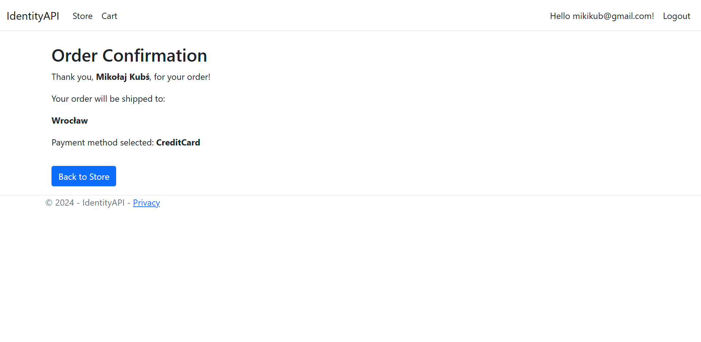

# .NET Course Solutions - PWr University

This document contains solutions to all the assignments from the .NET course at PWr University.

- 0-4 - HTML, CSS, and JavaScript
- 5-12 - first C#, then developing a bigger .NET application from lab 9 to 12
- 13 - Angular

Every assignment was graded at 100/100.

## Structure

Every folder contains my solution, lab tasks and lecture PDF.

## .NET Final Application

This application started as a basic MVC shop manager in Lab 9 and evolved into a more feature-rich and visually appealing e-commerce platform by Lab 12. Basically, this application allows admin to modify articles (for example grocery items) and check orders. Customers (users) to view the shop and order articles

### Key Features

#### Data Model and Persistence

1. **Article**: Represents store items with attributes:
   - Name
   - Price
   - Expiry Date
   - Category
   - Image (optional)
2. **Category**: Stores item categories with an ID and name
3. **Entity Framework Integration**:
   - CRUD operations for articles and categories
   - Database storage for product information
   - Image uploads stored in `wwwroot`, deleted when not needed

#### Data Access and Dependency Injection

1. **IArticlesContext Interface**:
   - Defines CRUD operations for articles
   - Implemented as mock and as connected to EntityFramework

#### User Interface and Functionality

1. **Views & Layouts**:
   - Uses HTML helpers, tag helpers, and a clean UI design with Bootstrap
   - Bootstrap-based tile layout alternative view
2. **Session Management**:
   - Persistent shopping cart stored in cookies for up to a week.

#### Shopping Cart Features

1. **Cart Management**:
   - Items added via AJAX
   - Stored in cookies with quantity tracking
   - Independent per user
2. **Cart UI**:
   - Displays cart contents with item counts and total cost
   - Users can modify quantities or remove items, with action displayed as icons
   - Empty cart message displayed if no items present

#### User Authentication and Authorization

1. **Account Creation & Login**:
   - Users can create an account
   - Authentication required to place orders
2. **Role-Based Access**:
   - **Admin**: Can manage categories and articles
   - **Users**: Can add items to cart and place orders
   - **Menu Adjustments**: Visibility of options based on role

#### Order Processing

1. **Order Submission**:
   - Summary table showing cart contents
   - User inputs personal details and selects payment method
   - Order confirmation page with details and cleared cart
   - Order is saved to the database.

#### API and Asynchronous Features

1. **REST API**:
   - Supports CRUD operations for articles and categories.
   - Tested using Swagger and Postman
2. **Lazy Loading Products**:
   - Loads initial batch of items
   - Fetches more via AJAX when scrolling down

### Screenshots

